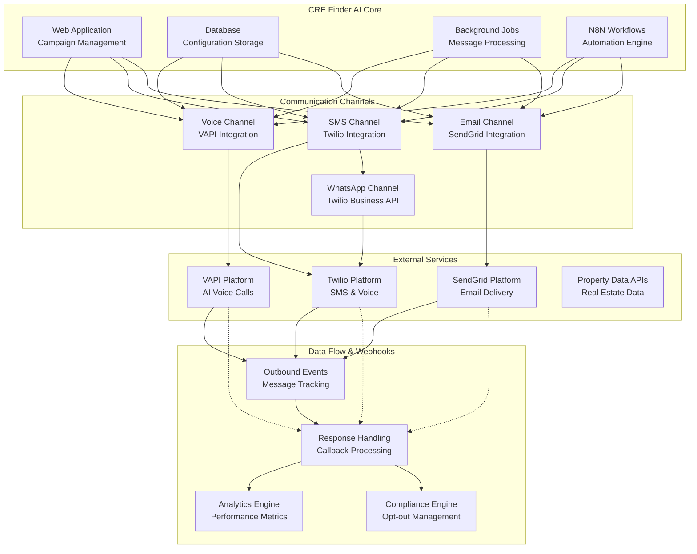

# 🔌 CRE Finder AI - Integration Guidelines

## 🎯 Purpose
**Think of this as your cookbook for connecting CRE Finder AI with the outside world!**

This document provides detailed instructions for integrating CRE Finder AI with external services like VAPI (Voice AI), Twilio (SMS/Voice), and SendGrid (Email). It's like having a step-by-step recipe for making all these services work together perfectly.

---

## 🏗️ Integration Architecture



---

## 🤖 VAPI Integration (Voice AI)

### 📞 What VAPI Does
**Think of VAPI as hiring a super smart robot that can make phone calls for you!**

VAPI creates AI-powered phone calls that:
- Sound like real humans talking
- Can have conversations about buying properties
- Handle questions and objections naturally
- Schedule follow-up calls automatically
- Take detailed notes of every conversation

### 🔧 VAPI Configuration Architecture



```mermaid
graph TD
    subgraph "VAPI Setup Flow"
        A[User Opens Integration Settings] --> B[VAPI Configuration Dialog]
        B --> C[Enter API Credentials]
        C --> D[Test Connection]
        D --> E{Connection Valid?}
        E -->|Yes| F[Save Configuration]
        E -->|No| G[Show Error Message]
        F --> H[Configure Voice Assistant]
        H --> I[Set Conversation Script]
        I --> J[Test Voice Call]
        J --> K[Ready for Campaigns]
    end
    
    subgraph "Voice Assistant Configuration"
        L[Assistant Name] --> M[AI Model Selection]
        M --> N[Voice Selection]
        N --> O[Conversation Prompt]
        O --> P[First Message]
        P --> Q[Objection Handling]
        Q --> R[Call Completion Actions]
    end
    
    subgraph "Campaign Execution"
        S[Select Properties] --> T[Create Voice Campaign]
        T --> U[Generate Personalized Scripts]
        U --> V[Queue Voice Calls]
        V --> W[VAPI Makes Calls]
        W --> X[Track Call Results]
        X --> Y[Update Property Records]
        Y --> Z[Trigger Follow-ups]
    end
```

#### 1. **VAPI Configuration Implementation**

```typescript
// packages/supabase/src/validations/integrations.ts
import { z } from "zod";

export const vapiConfigSchema = z.object({
  // Required fields
  apiKey: z.string().min(1, "API Key is required"),
  orgId: z.string().min(1, "Organization ID is required"),
  
  // Optional but recommended
  publicKey: z.string().optional(),
  assistantId: z.string().optional(),
  webhookSecret: z.string().optional(),
  phoneNumber: z.string().optional(),
  serverUrl: z.string().url().optional(),
  
  // Advanced settings
  maxCallDuration: z.number().min(30).max(1800).default(300), // 5 minutes default
  voiceSpeed: z.number().min(0.5).max(2.0).default(1.0),
  temperature: z.number().min(0).max(1).default(0.7),
});

export type VapiConfig = z.infer<typeof vapiConfigSchema>;
```

```typescript
// components/integrations/vapi-config-dialog.tsx
"use client";

import { useState } from "react";
import { useForm } from "react-hook-form";
import { zodResolver } from "@hookform/resolvers/zod";
import { Button } from "@v1/ui/button";
import { Input } from "@v1/ui/input";
import { Label } from "@v1/ui/label";
import { Textarea } from "@v1/ui/textarea";
import { Select } from "@v1/ui/select";
import { vapiConfigSchema, type VapiConfig } from "@v1/supabase/validations/integrations";

interface VapiConfigDialogProps {
  open: boolean;
  onOpenChange: (open: boolean) => void;
  initialConfig?: Partial<VapiConfig>;
  onSave: (config: VapiConfig) => Promise<void>;
}

export function VapiConfigDialog({ 
  open, 
  onOpenChange, 
  initialConfig, 
  onSave 
}: VapiConfigDialogProps) {
  const [isTestingConnection, setIsTestingConnection] = useState(false);
  const [connectionStatus, setConnectionStatus] = useState<"idle" | "success" | "error">("idle");
  
  const {
    register,
    handleSubmit,
    formState: { errors, isSubmitting },
    watch,
    setValue,
  } = useForm<VapiConfig>({
    resolver: zodResolver(vapiConfigSchema),
    defaultValues: {
      maxCallDuration: 300,
      voiceSpeed: 1.0,
      temperature: 0.7,
      ...initialConfig,
    },
  });
  
  // Test connection to VAPI
  const testConnection = async () => {
    setIsTestingConnection(true);
    try {
      const apiKey = watch("apiKey");
      const orgId = watch("orgId");
      
      if (!apiKey || !orgId) {
        throw new Error("API Key and Organization ID are required");
      }
      
      const response = await fetch("/api/integrations/vapi/test", {
        method: "POST",
        headers: { "Content-Type": "application/json" },
        body: JSON.stringify({ apiKey, orgId }),
      });
      
      if (response.ok) {
        setConnectionStatus("success");
      } else {
        throw new Error("Connection failed");
      }
    } catch (error) {
      setConnectionStatus("error");
      console.error("VAPI connection test failed:", error);
    } finally {
      setIsTestingConnection(false);
    }
  };
  
  const onSubmit = async (data: VapiConfig) => {
    try {
      await onSave(data);
      onOpenChange(false);
    } catch (error) {
      console.error("Failed to save VAPI configuration:", error);
    }
  };
  
  return (
    <Dialog open={open} onOpenChange={onOpenChange}>
      <DialogContent className="max-w-2xl">
        <DialogHeader>
          <DialogTitle>Configure VAPI (Voice AI)</DialogTitle>
          <DialogDescription>
            Set up AI-powered voice calls for your property campaigns
          </DialogDescription>
        </DialogHeader>
        
        <form onSubmit={handleSubmit(onSubmit)} className="space-y-6">
          {/* API Credentials */}
          <div className="grid grid-cols-2 gap-4">
            <div>
              <Label htmlFor="apiKey">API Key *</Label>
              <Input
                {...register("apiKey")}
                type="password"
                placeholder="vapi_xxx"
                className={errors.apiKey ? "border-red-500" : ""}
              />
              {errors.apiKey && (
                <p className="text-sm text-red-500 mt-1">{errors.apiKey.message}</p>
              )}
            </div>
            
            <div>
              <Label htmlFor="orgId">Organization ID *</Label>
              <Input
                {...register("orgId")}
                placeholder="org_xxx"
                className={errors.orgId ? "border-red-500" : ""}
              />
              {errors.orgId && (
                <p className="text-sm text-red-500 mt-1">{errors.orgId.message}</p>
              )}
            </div>
          </div>
          
          {/* Connection Test */}
          <div className="flex items-center gap-4">
            <Button 
              type="button" 
              variant="outline" 
              onClick={testConnection}
              disabled={isTestingConnection}
            >
              {isTestingConnection ? "Testing..." : "Test Connection"}
            </Button>
            
            {connectionStatus === "success" && (
              <span className="text-green-600 text-sm">✅ Connection successful</span>
            )}
            {connectionStatus === "error" && (
              <span className="text-red-600 text-sm">❌ Connection failed</span>
            )}
          </div>
          
          {/* Optional Settings */}
          <div className="grid grid-cols-2 gap-4">
            <div>
              <Label htmlFor="phoneNumber">Phone Number</Label>
              <Input
                {...register("phoneNumber")}
                placeholder="+1234567890"
              />
            </div>
            
            <div>
              <Label htmlFor="assistantId">Assistant ID</Label>
              <Input
                {...register("assistantId")}
                placeholder="assistant_xxx"
              />
            </div>
          </div>
          
          {/* Voice Settings */}
          <div className="grid grid-cols-3 gap-4">
            <div>
              <Label htmlFor="maxCallDuration">Max Call Duration (seconds)</Label>
              <Input
                {...register("maxCallDuration", { valueAsNumber: true })}
                type="number"
                min="30"
                max="1800"
              />
            </div>
            
            <div>
              <Label htmlFor="voiceSpeed">Voice Speed</Label>
              <Input
                {...register("voiceSpeed", { valueAsNumber: true })}
                type="number"
                min="0.5"
                max="2.0"
                step="0.1"
              />
            </div>
            
            <div>
              <Label htmlFor="temperature">AI Temperature</Label>
              <Input
                {...register("temperature", { valueAsNumber: true })}
                type="number"
                min="0"
                max="1"
                step="0.1"
              />
            </div>
          </div>
          
          {/* Advanced Settings */}
          <div>
            <Label htmlFor="webhookSecret">Webhook Secret</Label>
            <Input
              {...register("webhookSecret")}
              type="password"
              placeholder="webhook_secret_xxx"
            />
          </div>
          
          <div>
            <Label htmlFor="serverUrl">Server URL (optional)</Label>
            <Input
              {...register("serverUrl")}
              placeholder="https://your-server.com"
            />
          </div>
          
          {/* Submit Buttons */}
          <div className="flex justify-end gap-4">
            <Button type="button" variant="outline" onClick={() => onOpenChange(false)}>
              Cancel
            </Button>
            <Button type="submit" disabled={isSubmitting}>
              {isSubmitting ? "Saving..." : "Save Configuration"}
            </Button>
          </div>
        </form>
      </DialogContent>
    </Dialog>
  );
}
```

#### 2. **VAPI API Integration**

```typescript
// app/api/vapi/call/route.ts
import { NextRequest, NextResponse } from "next/server";
import { createClient } from "@v1/supabase/server";
import { z } from "zod";

const vapiCallSchema = z.object({
  phoneNumber: z.string().min(1, "Phone number is required"),
  assistantId: z.string().min(1, "Assistant ID is required"),
  metadata: z.object({
    propertyId: z.string(),
    ownerName: z.string(),
    propertyAddress: z.string(),
    campaignId: z.string().optional(),
  }),
});

export async function POST(request: NextRequest) {
  try {
    // 1. Authenticate user
    const supabase = createClient();
    const { data: { user }, error: authError } = await supabase.auth.getUser();
    
    if (authError || !user) {
      return NextResponse.json({ error: "Unauthorized" }, { status: 401 });
    }
    
    // 2. Validate request body
    const body = await request.json();
    const validatedData = vapiCallSchema.parse(body);
    
    // 3. Get VAPI configuration
    const { data: config } = await supabase
      .from("integration_configs")
      .select("config")
      .eq("user_id", user.id)
      .eq("provider", "vapi")
      .single();
    
    if (!config?.config) {
      return NextResponse.json(
        { error: "VAPI not configured" },
        { status: 400 }
      );
    }
    
    const vapiConfig = config.config as any;
    
    // 4. Create personalized script
    const script = generatePersonalizedScript(validatedData.metadata);
    
    // 5. Make VAPI call
    const vapiResponse = await fetch("https://api.vapi.ai/call", {
      method: "POST",
      headers: {
        "Authorization": `Bearer ${vapiConfig.apiKey}`,
        "Content-Type": "application/json",
      },
      body: JSON.stringify({
        phoneNumberId: vapiConfig.phoneNumber,
        assistantId: validatedData.assistantId,
        customer: {
          number: validatedData.phoneNumber,
        },
        assistantOverrides: {
          firstMessage: script.firstMessage,
          systemPrompt: script.systemPrompt,
          metadata: validatedData.metadata,
        },
      }),
    });
    
    if (!vapiResponse.ok) {
      throw new Error(`VAPI call failed: ${vapiResponse.statusText}`);
    }
    
    const callData = await vapiResponse.json();
    
    // 6. Log outbound event
    await supabase.from("outbound_events").insert({
      user_id: user.id,
      channel: "voice",
      to_contact: validatedData.phoneNumber,
      status: "initiated",
      payload: {
        vapiCallId: callData.id,
        propertyId: validatedData.metadata.propertyId,
        assistantId: validatedData.assistantId,
      },
    });
    
    return NextResponse.json({
      success: true,
      callId: callData.id,
      status: "initiated",
    });
    
  } catch (error) {
    console.error("VAPI call error:", error);
    
    if (error instanceof z.ZodError) {
      return NextResponse.json(
        { error: "Validation failed", details: error.flatten() },
        { status: 400 }
      );
    }
    
    return NextResponse.json(
      { error: "Internal server error" },
      { status: 500 }
    );
  }
}

function generatePersonalizedScript(metadata: any) {
  const { ownerName, propertyAddress } = metadata;
  
  return {
    firstMessage: `Hi ${ownerName}, this is Sarah calling about your property at ${propertyAddress}. I'm a local real estate investor and I'm interested in potentially purchasing your property. Do you have a moment to chat?`,
    systemPrompt: `You are Sarah, a professional and friendly real estate investor. You are calling ${ownerName} about their property at ${propertyAddress}. 

Your goal is to:
1. Politely introduce yourself and your interest in their property
2. Ask if they would consider selling
3. If interested, gather basic information about the property condition and their timeline
4. If not interested, thank them and end the call politely
5. If they want to think about it, offer to call back in a few days

Keep the conversation natural, professional, and brief. Don't be pushy. If they say they're not interested, respect their decision immediately and end the call.

Property details: ${propertyAddress}
Owner name: ${ownerName}`,
  };
}
```

#### 3. **VAPI Webhook Handling**

```typescript
// app/api/webhooks/vapi/route.ts
import { NextRequest, NextResponse } from "next/server";
import { createClient } from "@v1/supabase/admin";
import crypto from "crypto";

export async function POST(request: NextRequest) {
  try {
    // 1. Verify webhook signature
    const signature = request.headers.get("vapi-signature");
    const body = await request.text();
    
    if (!verifyVapiSignature(body, signature)) {
      return NextResponse.json({ error: "Invalid signature" }, { status: 401 });
    }
    
    const webhookData = JSON.parse(body);
    const { type, call } = webhookData;
    
    // 2. Initialize Supabase admin client
    const supabase = createClient();
    
    // 3. Process different webhook types
    switch (type) {
      case "call-started":
        await handleCallStarted(supabase, call);
        break;
        
      case "call-ended":
        await handleCallEnded(supabase, call);
        break;
        
      case "transcript":
        await handleTranscript(supabase, call);
        break;
        
      default:
        console.log("Unknown VAPI webhook type:", type);
    }
    
    return NextResponse.json({ success: true });
    
  } catch (error) {
    console.error("VAPI webhook error:", error);
    return NextResponse.json({ error: "Webhook processing failed" }, { status: 500 });
  }
}

async function handleCallStarted(supabase: any, call: any) {
  // Update outbound event status
  await supabase
    .from("outbound_events")
    .update({
      status: "in_progress",
      payload: { ...call, startedAt: new Date().toISOString() },
    })
    .eq("payload->vapiCallId", call.id);
}

async function handleCallEnded(supabase: any, call: any) {
  const { endedReason, duration, cost, transcript } = call;
  
  // Update outbound event with results
  await supabase
    .from("outbound_events")
    .update({
      status: endedReason === "customer-ended-call" ? "completed" : "failed",
      cost_cents: Math.round(cost * 100), // Convert to cents
      payload: {
        ...call,
        endedAt: new Date().toISOString(),
        duration,
        transcript,
        endedReason,
      },
    })
    .eq("payload->vapiCallId", call.id);
  
  // Extract insights from transcript
  if (transcript) {
    const insights = analyzeCallTranscript(transcript);
    
    // Update property record with call insights
    if (call.metadata?.propertyId) {
      await supabase
        .from("property_records")
        .update({
          skip_trace_data: {
            lastCallDate: new Date().toISOString(),
            callResult: endedReason,
            interestLevel: insights.interestLevel,
            notes: insights.summary,
          },
        })
        .eq("id", call.metadata.propertyId);
    }
  }
}

async function handleTranscript(supabase: any, call: any) {
  // Store real-time transcript updates
  await supabase
    .from("call_transcripts")
    .upsert({
      call_id: call.id,
      transcript: call.transcript,
      updated_at: new Date().toISOString(),
    });
}

function verifyVapiSignature(body: string, signature: string | null): boolean {
  if (!signature || !process.env.VAPI_WEBHOOK_SECRET) {
    return false;
  }
  
  const expectedSignature = crypto
    .createHmac("sha256", process.env.VAPI_WEBHOOK_SECRET)
    .update(body)
    .digest("hex");
  
  return crypto.timingSafeEqual(
    Buffer.from(signature),
    Buffer.from(expectedSignature)
  );
}

function analyzeCallTranscript(transcript: string) {
  // Simple keyword analysis (in production, use AI for better analysis)
  const lowerTranscript = transcript.toLowerCase();
  
  let interestLevel = 0;
  if (lowerTranscript.includes("interested") || lowerTranscript.includes("maybe")) {
    interestLevel = 5;
  } else if (lowerTranscript.includes("not interested") || lowerTranscript.includes("no thanks")) {
    interestLevel = 1;
  } else {
    interestLevel = 3; // Neutral
  }
  
  return {
    interestLevel,
    summary: transcript.slice(0, 500), // First 500 characters as summary
    containsInterest: lowerTranscript.includes("sell") || lowerTranscript.includes("interested"),
    needsFollowUp: lowerTranscript.includes("call back") || lowerTranscript.includes("think about"),
  };
}
```

---

## 📱 Twilio Integration (SMS & Voice)

### 📞 What Twilio Does
**Think of Twilio as your personal phone company that can send texts and make calls for you!**

Twilio provides:
- SMS text messaging to property owners
- Traditional phone calls (non-AI)
- WhatsApp Business messaging
- Phone number management
- Call/SMS status tracking and analytics

### 🔧 Twilio Configuration Architecture



```mermaid
graph TD
    subgraph "Twilio Setup Flow"
        A[User Opens Twilio Settings] --> B[Enter Account Credentials]
        B --> C[Verify Account Access]
        C --> D[Select Phone Number]
        D --> E[Configure SMS Settings]
        E --> F[Configure Voice Settings]
        F --> G[Set Webhook URLs]
        G --> H[Test SMS/Voice]
        H --> I[Ready for Campaigns]
    end
    
    subgraph "Message Flow"
        J[Create SMS Campaign] --> K[Validate Phone Numbers]
        K --> L[Generate Message Content]
        L --> M[Send via Twilio API]
        M --> N[Track Delivery Status]
        N --> O[Handle Responses]
        O --> P[Update Contact Records]
    end
    
    subgraph "Compliance Features"
        Q[Opt-out Management] --> R[STOP/UNSUBSCRIBE Handling]
        R --> S[Do Not Call Registry]
        S --> T[Time Zone Compliance]
        T --> U[Message Rate Limiting]
    end
```

#### 1. **Twilio Configuration Implementation**

```typescript
// packages/supabase/src/validations/integrations.ts
export const twilioConfigSchema = z.object({
  // Required credentials
  accountSid: z.string().startsWith("AC", "Invalid Account SID").min(1, "Account SID is required"),
  authToken: z.string().min(1, "Auth Token is required"),
  
  // Optional but recommended
  apiKey: z.string().optional(),
  apiSecret: z.string().optional(),
  phoneNumber: z.string().optional(),
  whatsappNumber: z.string().optional(),
  
  // Service SIDs
  messagingServiceSid: z.string().optional(),
  verifyServiceSid: z.string().optional(),
  twimlAppSid: z.string().optional(),
  
  // Webhook URLs
  smsWebhookUrl: z.string().url().optional(),
  voiceWebhookUrl: z.string().url().optional(),
  
  // Compliance settings
  respectQuietHours: z.boolean().default(true),
  timeZoneHandling: z.boolean().default(true),
  autoOptOutHandling: z.boolean().default(true),
});

export type TwilioConfig = z.infer<typeof twilioConfigSchema>;
```

```typescript
// components/integrations/twilio-config-dialog.tsx
"use client";

import { useState, useEffect } from "react";
import { useForm } from "react-hook-form";
import { zodResolver } from "@hookform/resolvers/zod";
import { twilioConfigSchema, type TwilioConfig } from "@v1/supabase/validations/integrations";

export function TwilioConfigDialog({ 
  open, 
  onOpenChange, 
  initialConfig, 
  onSave 
}: TwilioConfigDialogProps) {
  const [availableNumbers, setAvailableNumbers] = useState<string[]>([]);
  const [isLoadingNumbers, setIsLoadingNumbers] = useState(false);
  
  const {
    register,
    handleSubmit,
    formState: { errors, isSubmitting },
    watch,
    setValue,
  } = useForm<TwilioConfig>({
    resolver: zodResolver(twilioConfigSchema),
    defaultValues: {
      respectQuietHours: true,
      timeZoneHandling: true,
      autoOptOutHandling: true,
      ...initialConfig,
    },
  });
  
  const accountSid = watch("accountSid");
  const authToken = watch("authToken");
  
  // Load available phone numbers when credentials are provided
  useEffect(() => {
    if (accountSid && authToken) {
      loadAvailableNumbers();
    }
  }, [accountSid, authToken]);
  
  const loadAvailableNumbers = async () => {
    setIsLoadingNumbers(true);
    try {
      const response = await fetch("/api/integrations/twilio/numbers", {
        method: "POST",
        headers: { "Content-Type": "application/json" },
        body: JSON.stringify({ accountSid, authToken }),
      });
      
      if (response.ok) {
        const { numbers } = await response.json();
        setAvailableNumbers(numbers);
      }
    } catch (error) {
      console.error("Failed to load phone numbers:", error);
    } finally {
      setIsLoadingNumbers(false);
    }
  };
  
  const testSMS = async () => {
    const phoneNumber = watch("phoneNumber");
    if (!phoneNumber) {
      alert("Please select a phone number first");
      return;
    }
    
    try {
      const response = await fetch("/api/integrations/twilio/test-sms", {
        method: "POST",
        headers: { "Content-Type": "application/json" },
        body: JSON.stringify({
          accountSid,
          authToken,
          from: phoneNumber,
          to: "+1234567890", // Test number
          message: "Test message from CRE Finder AI",
        }),
      });
      
      if (response.ok) {
        alert("Test SMS sent successfully!");
      } else {
        alert("Failed to send test SMS");
      }
    } catch (error) {
      alert("Error sending test SMS");
    }
  };
  
  return (
    <Dialog open={open} onOpenChange={onOpenChange}>
      <DialogContent className="max-w-3xl max-h-[80vh] overflow-y-auto">
        <DialogHeader>
          <DialogTitle>Configure Twilio (SMS & Voice)</DialogTitle>
          <DialogDescription>
            Set up SMS messaging and voice calls for your property campaigns
          </DialogDescription>
        </DialogHeader>
        
        <form onSubmit={handleSubmit(onSave)} className="space-y-6">
          {/* Account Credentials */}
          <div className="grid grid-cols-2 gap-4">
            <div>
              <Label htmlFor="accountSid">Account SID *</Label>
              <Input
                {...register("accountSid")}
                placeholder="ACxxxxxxxxxxxxxxxxxxxxxxxxxxxxx"
                className={errors.accountSid ? "border-red-500" : ""}
              />
              {errors.accountSid && (
                <p className="text-sm text-red-500 mt-1">{errors.accountSid.message}</p>
              )}
            </div>
            
            <div>
              <Label htmlFor="authToken">Auth Token *</Label>
              <Input
                {...register("authToken")}
                type="password"
                placeholder="Your Auth Token"
                className={errors.authToken ? "border-red-500" : ""}
              />
              {errors.authToken && (
                <p className="text-sm text-red-500 mt-1">{errors.authToken.message}</p>
              )}
            </div>
          </div>
          
          {/* Phone Number Selection */}
          <div className="grid grid-cols-2 gap-4">
            <div>
              <Label htmlFor="phoneNumber">SMS Phone Number</Label>
              <Select 
                onValueChange={(value) => setValue("phoneNumber", value)}
                defaultValue={watch("phoneNumber")}
              >
                <SelectTrigger>
                  <SelectValue placeholder={isLoadingNumbers ? "Loading..." : "Select phone number"} />
                </SelectTrigger>
                <SelectContent>
                  {availableNumbers.map((number) => (
                    <SelectItem key={number} value={number}>
                      {number}
                    </SelectItem>
                  ))}
                </SelectContent>
              </Select>
            </div>
            
            <div>
              <Label htmlFor="whatsappNumber">WhatsApp Number</Label>
              <Select 
                onValueChange={(value) => setValue("whatsappNumber", value)}
                defaultValue={watch("whatsappNumber")}
              >
                <SelectTrigger>
                  <SelectValue placeholder="Select WhatsApp number" />
                </SelectTrigger>
                <SelectContent>
                  {availableNumbers.map((number) => (
                    <SelectItem key={number} value={`whatsapp:${number}`}>
                      {number} (WhatsApp)
                    </SelectItem>
                  ))}
                </SelectContent>
              </Select>
            </div>
          </div>
          
          {/* Service Configuration */}
          <div className="grid grid-cols-2 gap-4">
            <div>
              <Label htmlFor="messagingServiceSid">Messaging Service SID</Label>
              <Input
                {...register("messagingServiceSid")}
                placeholder="MGxxxxxxxxxxxxxxxxxxxxxxxxxxxxx"
              />
            </div>
            
            <div>
              <Label htmlFor="verifyServiceSid">Verify Service SID</Label>
              <Input
                {...register("verifyServiceSid")}
                placeholder="VAxxxxxxxxxxxxxxxxxxxxxxxxxxxxx"
              />
            </div>
          </div>
          
          {/* Webhook URLs */}
          <div className="grid grid-cols-2 gap-4">
            <div>
              <Label htmlFor="smsWebhookUrl">SMS Status Webhook URL</Label>
              <Input
                {...register("smsWebhookUrl")}
                placeholder="https://your-domain.com/api/webhooks/twilio/sms"
                defaultValue={`${window.location.origin}/api/webhooks/twilio/sms`}
              />
            </div>
            
            <div>
              <Label htmlFor="voiceWebhookUrl">Voice Webhook URL</Label>
              <Input
                {...register("voiceWebhookUrl")}
                placeholder="https://your-domain.com/api/webhooks/twilio/voice"
                defaultValue={`${window.location.origin}/api/webhooks/twilio/voice`}
              />
            </div>
          </div>
          
          {/* Compliance Settings */}
          <div className="space-y-4">
            <h3 className="text-lg font-semibold">Compliance Settings</h3>
            
            <div className="flex items-center space-x-2">
              <Checkbox {...register("respectQuietHours")} id="respectQuietHours" />
              <Label htmlFor="respectQuietHours">
                Respect quiet hours (9 AM - 8 PM local time)
              </Label>
            </div>
            
            <div className="flex items-center space-x-2">
              <Checkbox {...register("timeZoneHandling")} id="timeZoneHandling" />
              <Label htmlFor="timeZoneHandling">
                Handle recipient time zones automatically
              </Label>
            </div>
            
            <div className="flex items-center space-x-2">
              <Checkbox {...register("autoOptOutHandling")} id="autoOptOutHandling" />
              <Label htmlFor="autoOptOutHandling">
                Automatically handle STOP/UNSUBSCRIBE requests
              </Label>
            </div>
          </div>
          
          {/* Test & Save Buttons */}
          <div className="flex justify-between">
            <Button type="button" variant="outline" onClick={testSMS}>
              Test SMS
            </Button>
            
            <div className="flex gap-4">
              <Button type="button" variant="outline" onClick={() => onOpenChange(false)}>
                Cancel
              </Button>
              <Button type="submit" disabled={isSubmitting}>
                {isSubmitting ? "Saving..." : "Save Configuration"}
              </Button>
            </div>
          </div>
        </form>
      </DialogContent>
    </Dialog>
  );
}
```

#### 2. **Twilio SMS Implementation**

```typescript
// app/api/twilio/sms/route.ts
import { NextRequest, NextResponse } from "next/server";
import { createClient } from "@v1/supabase/server";
import twilio from "twilio";
import { z } from "zod";

const sendSMSSchema = z.object({
  to: z.string().min(1, "Phone number is required"),
  message: z.string().min(1, "Message is required").max(1600), // SMS limit
  propertyId: z.string().optional(),
  campaignId: z.string().optional(),
  scheduledAt: z.string().datetime().optional(),
  mediaUrl: z.array(z.string().url()).optional(),
});

export async function POST(request: NextRequest) {
  try {
    // 1. Authenticate user
    const supabase = createClient();
    const { data: { user }, error: authError } = await supabase.auth.getUser();
    
    if (authError || !user) {
      return NextResponse.json({ error: "Unauthorized" }, { status: 401 });
    }
    
    // 2. Validate request
    const body = await request.json();
    const validatedData = sendSMSSchema.parse(body);
    
    // 3. Get Twilio configuration
    const { data: config } = await supabase
      .from("integration_configs")
      .select("config")
      .eq("user_id", user.id)
      .eq("provider", "twilio")
      .single();
    
    if (!config?.config) {
      return NextResponse.json(
        { error: "Twilio not configured" },
        { status: 400 }
      );
    }
    
    const twilioConfig = config.config as any;
    
    // 4. Check opt-out status
    const isOptedOut = await checkOptOutStatus(supabase, user.id, validatedData.to);
    if (isOptedOut) {
      return NextResponse.json(
        { error: "Recipient has opted out" },
        { status: 400 }
      );
    }
    
    // 5. Check quiet hours (if enabled)
    if (twilioConfig.respectQuietHours) {
      const isQuietHours = await checkQuietHours(validatedData.to);
      if (isQuietHours) {
        return NextResponse.json(
          { error: "Cannot send during quiet hours" },
          { status: 400 }
        );
      }
    }
    
    // 6. Initialize Twilio client
    const client = twilio(twilioConfig.accountSid, twilioConfig.authToken);
    
    // 7. Prepare message options
    const messageOptions: any = {
      body: validatedData.message,
      to: validatedData.to,
      from: twilioConfig.phoneNumber,
      statusCallback: `${process.env.NEXT_PUBLIC_APP_URL}/api/webhooks/twilio/sms`,
    };
    
    if (validatedData.mediaUrl) {
      messageOptions.mediaUrl = validatedData.mediaUrl;
    }
    
    if (validatedData.scheduledAt) {
      messageOptions.sendAt = new Date(validatedData.scheduledAt);
      messageOptions.scheduleType = "fixed";
      // Use messaging service for scheduled messages
      if (twilioConfig.messagingServiceSid) {
        messageOptions.messagingServiceSid = twilioConfig.messagingServiceSid;
        delete messageOptions.from;
      }
    }
    
    // 8. Send SMS
    const message = await client.messages.create(messageOptions);
    
    // 9. Log outbound event
    await supabase.from("outbound_events").insert({
      user_id: user.id,
      channel: "sms",
      to_contact: validatedData.to,
      status: message.status,
      cost_cents: message.price ? Math.round(parseFloat(message.price) * 100) : null,
      payload: {
        twilioSid: message.sid,
        propertyId: validatedData.propertyId,
        campaignId: validatedData.campaignId,
        messageBody: validatedData.message,
        scheduledAt: validatedData.scheduledAt,
      },
    });
    
    return NextResponse.json({
      success: true,
      messageSid: message.sid,
      status: message.status,
      to: message.to,
    });
    
  } catch (error) {
    console.error("Twilio SMS error:", error);
    
    if (error instanceof z.ZodError) {
      return NextResponse.json(
        { error: "Validation failed", details: error.flatten() },
        { status: 400 }
      );
    }
    
    return NextResponse.json(
      { error: "Failed to send SMS" },
      { status: 500 }
    );
  }
}

async function checkOptOutStatus(supabase: any, userId: string, phoneNumber: string): Promise<boolean> {
  const { data } = await supabase
    .from("opt_outs")
    .select("id")
    .eq("user_id", userId)
    .eq("phone_number", phoneNumber)
    .eq("is_active", true)
    .single();
  
  return !!data;
}

async function checkQuietHours(phoneNumber: string): Promise<boolean> {
  // Simple implementation - in production, use proper timezone lookup
  const now = new Date();
  const hour = now.getHours();
  
  // Quiet hours: before 9 AM or after 8 PM
  return hour < 9 || hour >= 20;
}
```

#### 3. **Twilio Webhook Handling**

```typescript
// app/api/webhooks/twilio/sms/route.ts
import { NextRequest, NextResponse } from "next/server";
import { createClient } from "@v1/supabase/admin";
import twilio from "twilio";

export async function POST(request: NextRequest) {
  try {
    // 1. Parse Twilio webhook data
    const formData = await request.formData();
    const webhookData = Object.fromEntries(formData.entries());
    
    // 2. Verify webhook (optional but recommended)
    // const isValid = twilio.validateRequest(
    //   process.env.TWILIO_AUTH_TOKEN!,
    //   request.headers.get("x-twilio-signature")!,
    //   request.url,
    //   webhookData
    // );
    
    // 3. Initialize Supabase
    const supabase = createClient();
    
    // 4. Update outbound event status
    await supabase
      .from("outbound_events")
      .update({
        status: webhookData.MessageStatus as string,
        payload: {
          ...webhookData,
          updatedAt: new Date().toISOString(),
        },
      })
      .eq("payload->twilioSid", webhookData.MessageSid);
    
    // 5. Handle opt-out requests
    if (isOptOutMessage(webhookData.Body as string)) {
      await handleOptOut(supabase, webhookData);
    }
    
    // 6. Handle incoming responses
    if (webhookData.MessageStatus === "received") {
      await handleIncomingMessage(supabase, webhookData);
    }
    
    return NextResponse.json({ success: true });
    
  } catch (error) {
    console.error("Twilio SMS webhook error:", error);
    return NextResponse.json(
      { error: "Webhook processing failed" },
      { status: 500 }
    );
  }
}

function isOptOutMessage(message: string): boolean {
  const optOutKeywords = ["stop", "unsubscribe", "quit", "cancel", "end"];
  const lowerMessage = message.toLowerCase().trim();
  return optOutKeywords.includes(lowerMessage);
}

async function handleOptOut(supabase: any, webhookData: any) {
  // Add to opt-out list
  await supabase.from("opt_outs").upsert({
    phone_number: webhookData.From,
    channel: "sms",
    opted_out_at: new Date().toISOString(),
    is_active: true,
  });
  
  // Send confirmation message
  // Note: In production, ensure you have consent for confirmation messages
  console.log(`User ${webhookData.From} opted out via SMS`);
}

async function handleIncomingMessage(supabase: any, webhookData: any) {
  // Store incoming message
  await supabase.from("outbound_events").insert({
    channel: "sms",
    to_contact: webhookData.From,
    status: "received",
    payload: {
      message: webhookData.Body,
      from: webhookData.From,
      to: webhookData.To,
      receivedAt: new Date().toISOString(),
    },
  });
  
  // Trigger response handling workflow
  // This could integrate with your N8N workflows or background jobs
}
```

---

## 📧 SendGrid Integration (Email)

### 📮 What SendGrid Does
**Think of SendGrid as your super-powered post office that can send beautiful emails to thousands of people!**

SendGrid provides:
- Professional HTML email templates
- High deliverability rates (emails don't go to spam)
- Email tracking (opens, clicks, bounces)
- Unsubscribe management
- Bulk email sending capabilities

### 🔧 SendGrid Configuration Architecture



```mermaid
graph TD
    subgraph "SendGrid Setup Flow"
        A[User Opens Email Settings] --> B[Enter API Key]
        B --> C[Verify Domain]
        C --> D[Configure From Address]
        D --> E[Upload Email Templates]
        E --> F[Set Tracking Options]
        F --> G[Configure Unsubscribe Groups]
        G --> H[Test Email Send]
        H --> I[Ready for Campaigns]
    end
    
    subgraph "Email Campaign Flow"
        J[Create Email Campaign] --> K[Select Template]
        K --> L[Personalize Content]
        L --> M[Validate Recipients]
        M --> N[Send via SendGrid API]
        N --> O[Track Email Events]
        O --> P[Process Responses]
        P --> Q[Update Contact Records]
    end
    
    subgraph "Template Management"
        R[HTML Templates] --> S[Dynamic Content]
        S --> T[Personalization Tags]
        T --> U[A/B Testing]
        U --> V[Template Versioning]
    end
```

#### 1. **SendGrid Configuration Implementation**

```typescript
// packages/supabase/src/validations/integrations.ts
export const sendgridConfigSchema = z.object({
  // Required
  apiKey: z.string().startsWith("SG.", "Invalid SendGrid API key").min(1, "API Key is required"),
  fromEmail: z.string().email("Invalid email format").min(1, "From Email is required"),
  
  // Optional but recommended
  fromName: z.string().optional(),
  replyToEmail: z.string().email("Invalid email format").optional(),
  
  // Template settings
  defaultTemplateId: z.string().optional(),
  
  // Tracking settings
  clickTracking: z.boolean().default(true),
  openTracking: z.boolean().default(true),
  subscriptionTracking: z.boolean().default(true),
  
  // Unsubscribe groups
  unsubscribeGroupId: z.number().optional(),
  
  // Custom settings
  customDomain: z.string().optional(),
  ipPool: z.string().optional(),
});

export type SendGridConfig = z.infer<typeof sendgridConfigSchema>;
```

```typescript
// components/integrations/sendgrid-config-dialog.tsx
"use client";

import { useState } from "react";
import { useForm } from "react-hook-form";
import { zodResolver } from "@hookform/resolvers/zod";
import { sendgridConfigSchema, type SendGridConfig } from "@v1/supabase/validations/integrations";

export function SendGridConfigDialog({ 
  open, 
  onOpenChange, 
  initialConfig, 
  onSave 
}: SendGridConfigDialogProps) {
  const [templates, setTemplates] = useState<any[]>([]);
  const [unsubscribeGroups, setUnsubscribeGroups] = useState<any[]>([]);
  const [isLoadingTemplates, setIsLoadingTemplates] = useState(false);
  
  const {
    register,
    handleSubmit,
    formState: { errors, isSubmitting },
    watch,
    setValue,
  } = useForm<SendGridConfig>({
    resolver: zodResolver(sendgridConfigSchema),
    defaultValues: {
      clickTracking: true,
      openTracking: true,
      subscriptionTracking: true,
      ...initialConfig,
    },
  });
  
  const apiKey = watch("apiKey");
  
  // Load templates and unsubscribe groups when API key is provided
  useEffect(() => {
    if (apiKey && apiKey.startsWith("SG.")) {
      loadSendGridData();
    }
  }, [apiKey]);
  
  const loadSendGridData = async () => {
    setIsLoadingTemplates(true);
    try {
      const response = await fetch("/api/integrations/sendgrid/data", {
        method: "POST",
        headers: { "Content-Type": "application/json" },
        body: JSON.stringify({ apiKey }),
      });
      
      if (response.ok) {
        const { templates, unsubscribeGroups } = await response.json();
        setTemplates(templates);
        setUnsubscribeGroups(unsubscribeGroups);
      }
    } catch (error) {
      console.error("Failed to load SendGrid data:", error);
    } finally {
      setIsLoadingTemplates(false);
    }
  };
  
  const testEmail = async () => {
    const formData = watch();
    if (!formData.apiKey || !formData.fromEmail) {
      alert("Please provide API Key and From Email first");
      return;
    }
    
    try {
      const response = await fetch("/api/integrations/sendgrid/test-email", {
        method: "POST",
        headers: { "Content-Type": "application/json" },
        body: JSON.stringify({
          ...formData,
          testEmailTo: "test@example.com", // Replace with actual test email
        }),
      });
      
      if (response.ok) {
        alert("Test email sent successfully!");
      } else {
        alert("Failed to send test email");
      }
    } catch (error) {
      alert("Error sending test email");
    }
  };
  
  return (
    <Dialog open={open} onOpenChange={onOpenChange}>
      <DialogContent className="max-w-3xl max-h-[80vh] overflow-y-auto">
        <DialogHeader>
          <DialogTitle>Configure SendGrid (Email)</DialogTitle>
          <DialogDescription>
            Set up professional email campaigns for your property outreach
          </DialogDescription>
        </DialogHeader>
        
        <form onSubmit={handleSubmit(onSave)} className="space-y-6">
          {/* API Key */}
          <div>
            <Label htmlFor="apiKey">SendGrid API Key *</Label>
            <Input
              {...register("apiKey")}
              type="password"
              placeholder="SG.xxxxxxxxxxxxxxxxxx"
              className={errors.apiKey ? "border-red-500" : ""}
            />
            {errors.apiKey && (
              <p className="text-sm text-red-500 mt-1">{errors.apiKey.message}</p>
            )}
          </div>
          
          {/* From Email & Name */}
          <div className="grid grid-cols-2 gap-4">
            <div>
              <Label htmlFor="fromEmail">From Email Address *</Label>
              <Input
                {...register("fromEmail")}
                type="email"
                placeholder="noreply@yourdomain.com"
                className={errors.fromEmail ? "border-red-500" : ""}
              />
              {errors.fromEmail && (
                <p className="text-sm text-red-500 mt-1">{errors.fromEmail.message}</p>
              )}
            </div>
            
            <div>
              <Label htmlFor="fromName">From Name</Label>
              <Input
                {...register("fromName")}
                placeholder="Your Company Name"
              />
            </div>
          </div>
          
          {/* Reply-To Email */}
          <div>
            <Label htmlFor="replyToEmail">Reply-To Email</Label>
            <Input
              {...register("replyToEmail")}
              type="email"
              placeholder="replies@yourdomain.com"
            />
          </div>
          
          {/* Template Selection */}
          <div>
            <Label htmlFor="defaultTemplateId">Default Email Template</Label>
            <Select 
              onValueChange={(value) => setValue("defaultTemplateId", value)}
              defaultValue={watch("defaultTemplateId")}
            >
              <SelectTrigger>
                <SelectValue placeholder={isLoadingTemplates ? "Loading..." : "Select template"} />
              </SelectTrigger>
              <SelectContent>
                {templates.map((template) => (
                  <SelectItem key={template.id} value={template.id}>
                    {template.name}
                  </SelectItem>
                ))}
              </SelectContent>
            </Select>
          </div>
          
          {/* Unsubscribe Group */}
          <div>
            <Label htmlFor="unsubscribeGroupId">Unsubscribe Group</Label>
            <Select 
              onValueChange={(value) => setValue("unsubscribeGroupId", parseInt(value))}
              defaultValue={watch("unsubscribeGroupId")?.toString()}
            >
              <SelectTrigger>
                <SelectValue placeholder="Select unsubscribe group" />
              </SelectTrigger>
              <SelectContent>
                {unsubscribeGroups.map((group) => (
                  <SelectItem key={group.id} value={group.id.toString()}>
                    {group.name}
                  </SelectItem>
                ))}
              </SelectContent>
            </Select>
          </div>
          
          {/* Tracking Settings */}
          <div className="space-y-4">
            <h3 className="text-lg font-semibold">Email Tracking</h3>
            
            <div className="flex items-center space-x-2">
              <Checkbox {...register("clickTracking")} id="clickTracking" />
              <Label htmlFor="clickTracking">
                Track email clicks
              </Label>
            </div>
            
            <div className="flex items-center space-x-2">
              <Checkbox {...register("openTracking")} id="openTracking" />
              <Label htmlFor="openTracking">
                Track email opens
              </Label>
            </div>
            
            <div className="flex items-center space-x-2">
              <Checkbox {...register("subscriptionTracking")} id="subscriptionTracking" />
              <Label htmlFor="subscriptionTracking">
                Add unsubscribe links automatically
              </Label>
            </div>
          </div>
          
          {/* Advanced Settings */}
          <div className="grid grid-cols-2 gap-4">
            <div>
              <Label htmlFor="customDomain">Custom Domain</Label>
              <Input
                {...register("customDomain")}
                placeholder="email.yourdomain.com"
              />
            </div>
            
            <div>
              <Label htmlFor="ipPool">IP Pool</Label>
              <Input
                {...register("ipPool")}
                placeholder="marketing"
              />
            </div>
          </div>
          
          {/* Test & Save Buttons */}
          <div className="flex justify-between">
            <Button type="button" variant="outline" onClick={testEmail}>
              Send Test Email
            </Button>
            
            <div className="flex gap-4">
              <Button type="button" variant="outline" onClick={() => onOpenChange(false)}>
                Cancel
              </Button>
              <Button type="submit" disabled={isSubmitting}>
                {isSubmitting ? "Saving..." : "Save Configuration"}
              </Button>
            </div>
          </div>
        </form>
      </DialogContent>
    </Dialog>
  );
}
```

#### 2. **SendGrid Email Implementation**

```typescript
// app/api/sendgrid/email/route.ts
import { NextRequest, NextResponse } from "next/server";
import { createClient } from "@v1/supabase/server";
import sgMail from "@sendgrid/mail";
import { z } from "zod";

const sendEmailSchema = z.object({
  to: z.union([z.string().email(), z.array(z.string().email())]),
  subject: z.string().min(1, "Subject is required"),
  templateId: z.string().optional(),
  dynamicTemplateData: z.record(z.any()).optional(),
  htmlContent: z.string().optional(),
  textContent: z.string().optional(),
  attachments: z.array(z.object({
    content: z.string(),
    filename: z.string(),
    type: z.string(),
    disposition: z.string().default("attachment"),
  })).optional(),
  campaignId: z.string().optional(),
  propertyId: z.string().optional(),
  sendAt: z.string().datetime().optional(),
  categories: z.array(z.string()).optional(),
});

export async function POST(request: NextRequest) {
  try {
    // 1. Authenticate user
    const supabase = createClient();
    const { data: { user }, error: authError } = await supabase.auth.getUser();
    
    if (authError || !user) {
      return NextResponse.json({ error: "Unauthorized" }, { status: 401 });
    }
    
    // 2. Validate request
    const body = await request.json();
    const validatedData = sendEmailSchema.parse(body);
    
    // 3. Get SendGrid configuration
    const { data: config } = await supabase
      .from("integration_configs")
      .select("config")
      .eq("user_id", user.id)
      .eq("provider", "sendgrid")
      .single();
    
    if (!config?.config) {
      return NextResponse.json(
        { error: "SendGrid not configured" },
        { status: 400 }
      );
    }
    
    const sendGridConfig = config.config as any;
    
    // 4. Initialize SendGrid
    sgMail.setApiKey(sendGridConfig.apiKey);
    
    // 5. Prepare email message
    const emailMessage: any = {
      from: {
        email: sendGridConfig.fromEmail,
        name: sendGridConfig.fromName || "CRE Finder AI",
      },
      replyTo: sendGridConfig.replyToEmail,
      subject: validatedData.subject,
      trackingSettings: {
        clickTracking: { enable: sendGridConfig.clickTracking },
        openTracking: { enable: sendGridConfig.openTracking },
        subscriptionTracking: { enable: sendGridConfig.subscriptionTracking },
      },
    };
    
    // Handle single or multiple recipients
    if (Array.isArray(validatedData.to)) {
      emailMessage.personalizations = validatedData.to.map(email => ({
        to: [{ email }],
        dynamicTemplateData: validatedData.dynamicTemplateData,
      }));
    } else {
      emailMessage.to = validatedData.to;
      emailMessage.dynamicTemplateData = validatedData.dynamicTemplateData;
    }
    
    // Use template or custom content
    if (validatedData.templateId) {
      emailMessage.templateId = validatedData.templateId;
    } else {
      if (validatedData.htmlContent) {
        emailMessage.html = validatedData.htmlContent;
      }
      if (validatedData.textContent) {
        emailMessage.text = validatedData.textContent;
      }
    }
    
    // Add attachments
    if (validatedData.attachments) {
      emailMessage.attachments = validatedData.attachments;
    }
    
    // Schedule email
    if (validatedData.sendAt) {
      emailMessage.sendAt = Math.floor(new Date(validatedData.sendAt).getTime() / 1000);
    }
    
    // Add categories
    if (validatedData.categories) {
      emailMessage.categories = validatedData.categories;
    }
    
    // Add unsubscribe group
    if (sendGridConfig.unsubscribeGroupId) {
      emailMessage.asm = {
        groupId: sendGridConfig.unsubscribeGroupId,
      };
    }
    
    // 6. Send email
    const response = await sgMail.send(emailMessage);
    
    // 7. Log outbound events
    const recipients = Array.isArray(validatedData.to) ? validatedData.to : [validatedData.to];
    
    for (const recipient of recipients) {
      await supabase.from("outbound_events").insert({
        user_id: user.id,
        channel: "email",
        to_contact: recipient,
        status: "sent",
        payload: {
          sendGridMessageId: response[0].headers["x-message-id"],
          templateId: validatedData.templateId,
          subject: validatedData.subject,
          campaignId: validatedData.campaignId,
          propertyId: validatedData.propertyId,
          scheduledAt: validatedData.sendAt,
        },
      });
    }
    
    return NextResponse.json({
      success: true,
      messageId: response[0].headers["x-message-id"],
      recipients: recipients.length,
    });
    
  } catch (error) {
    console.error("SendGrid email error:", error);
    
    if (error instanceof z.ZodError) {
      return NextResponse.json(
        { error: "Validation failed", details: error.flatten() },
        { status: 400 }
      );
    }
    
    return NextResponse.json(
      { error: "Failed to send email" },
      { status: 500 }
    );
  }
}
```

#### 3. **SendGrid Webhook Implementation**

```typescript
// app/api/webhooks/sendgrid/route.ts
import { NextRequest, NextResponse } from "next/server";
import { createClient } from "@v1/supabase/admin";
import crypto from "crypto";

export async function POST(request: NextRequest) {
  try {
    // 1. Verify SendGrid webhook signature
    const body = await request.text();
    const signature = request.headers.get("x-twilio-email-event-webhook-signature");
    
    if (!verifyWebhookSignature(body, signature)) {
      return NextResponse.json({ error: "Invalid signature" }, { status: 401 });
    }
    
    const events = JSON.parse(body);
    
    // 2. Initialize Supabase
    const supabase = createClient();
    
    // 3. Process each event
    for (const event of events) {
      await processEmailEvent(supabase, event);
    }
    
    return NextResponse.json({ success: true });
    
  } catch (error) {
    console.error("SendGrid webhook error:", error);
    return NextResponse.json(
      { error: "Webhook processing failed" },
      { status: 500 }
    );
  }
}

async function processEmailEvent(supabase: any, event: any) {
  const { event: eventType, email, sg_message_id, timestamp } = event;
  
  // Update outbound event status
  await supabase
    .from("outbound_events")
    .update({
      status: eventType,
      payload: {
        ...event,
        processedAt: new Date().toISOString(),
      },
    })
    .eq("payload->sendGridMessageId", sg_message_id);
  
  // Handle specific event types
  switch (eventType) {
    case "delivered":
      await handleEmailDelivered(supabase, event);
      break;
      
    case "open":
      await handleEmailOpened(supabase, event);
      break;
      
    case "click":
      await handleEmailClicked(supabase, event);
      break;
      
    case "bounce":
    case "dropped":
      await handleEmailBounced(supabase, event);
      break;
      
    case "unsubscribe":
      await handleEmailUnsubscribe(supabase, event);
      break;
      
    case "spamreport":
      await handleSpamReport(supabase, event);
      break;
  }
}

async function handleEmailDelivered(supabase: any, event: any) {
  // Email successfully delivered
  console.log(`Email delivered to ${event.email}`);
}

async function handleEmailOpened(supabase: any, event: any) {
  // Track email open
  await supabase.from("email_analytics").upsert({
    email: event.email,
    message_id: event.sg_message_id,
    opened_at: new Date(event.timestamp * 1000).toISOString(),
    user_agent: event.useragent,
    ip: event.ip,
  });
}

async function handleEmailClicked(supabase: any, event: any) {
  // Track email click
  await supabase.from("email_analytics").upsert({
    email: event.email,
    message_id: event.sg_message_id,
    clicked_at: new Date(event.timestamp * 1000).toISOString(),
    clicked_url: event.url,
    user_agent: event.useragent,
    ip: event.ip,
  });
}

async function handleEmailBounced(supabase: any, event: any) {
  // Mark email as bounced and possibly add to suppression list
  await supabase.from("email_suppressions").upsert({
    email: event.email,
    reason: event.reason,
    type: event.type,
    suppressed_at: new Date(event.timestamp * 1000).toISOString(),
  });
}

async function handleEmailUnsubscribe(supabase: any, event: any) {
  // Add to unsubscribe list
  await supabase.from("opt_outs").upsert({
    email: event.email,
    channel: "email",
    opted_out_at: new Date(event.timestamp * 1000).toISOString(),
    is_active: true,
  });
}

async function handleSpamReport(supabase: any, event: any) {
  // Handle spam report
  await supabase.from("email_suppressions").upsert({
    email: event.email,
    reason: "spam_report",
    type: "spam",
    suppressed_at: new Date(event.timestamp * 1000).toISOString(),
  });
}

function verifyWebhookSignature(body: string, signature: string | null): boolean {
  if (!signature || !process.env.SENDGRID_WEBHOOK_SECRET) {
    return false;
  }
  
  const expectedSignature = crypto
    .createHmac("sha256", process.env.SENDGRID_WEBHOOK_SECRET)
    .update(body)
    .digest("base64");
  
  return crypto.timingSafeEqual(
    Buffer.from(signature),
    Buffer.from(expectedSignature)
  );
}
```

---

## 🔄 Multi-Channel Campaign Orchestration

### 🎼 Advanced Campaign Architecture

```mermaid
graph TB
    subgraph "Campaign Planning"
        A[Select Target Properties] --> B[Choose Communication Channels]
        B --> C[Configure Message Sequences]
        C --> D[Set Timing & Delays]
        D --> E[Define Success Metrics]
    end
    
    subgraph "Sequence Engine"
        F[Initial Contact] --> G{Response Received?}
        G -->|Yes| H[Nurture Sequence]
        G -->|No| I[Follow-up Schedule]
        I --> J[Next Channel Attempt]
        J --> K{Max Attempts?}
        K -->|No| F
        K -->|Yes| L[Mark Complete]
        H --> M[Continue Engagement]
    end
    
    subgraph "Channel Coordination"
        N[Voice AI - VAPI] --> O[Response Handler]
        P[SMS - Twilio] --> O
        Q[Email - SendGrid] --> O
        O --> R[Update Contact Status]
        R --> S[Trigger Next Action]
        S --> T[Schedule Follow-up]
    end
    
    subgraph "Analytics & Optimization"
        U[Track Channel Performance] --> V[A/B Test Messages]
        V --> W[Optimize Timing]
        W --> X[Improve Response Rates]
        X --> Y[Campaign ROI Analysis]
    end
```



#### 1. **Campaign Orchestration Implementation**

```typescript
// lib/campaign-orchestrator.ts
import { createClient } from "@v1/supabase/admin";

interface CampaignSequence {
  id: string;
  name: string;
  steps: CampaignStep[];
  triggerConditions: TriggerCondition[];
}

interface CampaignStep {
  id: string;
  channel: "voice" | "sms" | "email";
  delay: number; // milliseconds
  template: string;
  conditions?: StepCondition[];
}

interface TriggerCondition {
  event: "no_response" | "positive_response" | "negative_response";
  timeframe: number; // milliseconds
}

export class CampaignOrchestrator {
  private supabase = createClient();
  
  async createMultiChannelCampaign(
    userId: string,
    propertyIds: string[],
    sequence: CampaignSequence
  ) {
    // 1. Create campaign record
    const { data: campaign } = await this.supabase
      .from("campaigns")
      .insert({
        user_id: userId,
        name: sequence.name,
        channels: sequence.steps.map(s => s.channel),
        record_ids: propertyIds,
        status: "active",
      })
      .select()
      .single();
    
    // 2. Schedule initial contacts for each property
    for (const propertyId of propertyIds) {
      await this.scheduleSequenceForProperty(
        campaign.id,
        propertyId,
        sequence
      );
    }
    
    return campaign;
  }
  
  private async scheduleSequenceForProperty(
    campaignId: string,
    propertyId: string,
    sequence: CampaignSequence
  ) {
    // Get property owner contact info
    const { data: property } = await this.supabase
      .from("property_records")
      .select("*")
      .eq("id", propertyId)
      .single();
    
    if (!property) return;
    
    // Schedule each step in the sequence
    for (let i = 0; i < sequence.steps.length; i++) {
      const step = sequence.steps[i];
      const scheduleTime = new Date(Date.now() + step.delay);
      
      await this.scheduleStep({
        campaignId,
        propertyId,
        stepIndex: i,
        step,
        scheduleTime,
        property,
      });
    }
  }
  
  private async scheduleStep({
    campaignId,
    propertyId,
    stepIndex,
    step,
    scheduleTime,
    property,
  }: {
    campaignId: string;
    propertyId: string;
    stepIndex: number;
    step: CampaignStep;
    scheduleTime: Date;
    property: any;
  }) {
    // Create scheduled job based on channel
    switch (step.channel) {
      case "voice":
        await this.scheduleVoiceCall({
          campaignId,
          propertyId,
          stepIndex,
          scheduleTime,
          property,
          template: step.template,
        });
        break;
        
      case "sms":
        await this.scheduleSMS({
          campaignId,
          propertyId,
          stepIndex,
          scheduleTime,
          property,
          template: step.template,
        });
        break;
        
      case "email":
        await this.scheduleEmail({
          campaignId,
          propertyId,
          stepIndex,
          scheduleTime,
          property,
          template: step.template,
        });
        break;
    }
  }
  
  private async scheduleVoiceCall(params: any) {
    // Use your background job system (Trigger.dev, etc.)
    // to schedule the voice call
    console.log("Scheduling voice call:", params);
  }
  
  private async scheduleSMS(params: any) {
    // Schedule SMS send
    console.log("Scheduling SMS:", params);
  }
  
  private async scheduleEmail(params: any) {
    // Schedule email send
    console.log("Scheduling email:", params);
  }
  
  async handleResponse(
    campaignId: string,
    propertyId: string,
    channel: string,
    response: "positive" | "negative" | "neutral"
  ) {
    // Update campaign status based on response
    await this.supabase
      .from("campaign_responses")
      .upsert({
        campaign_id: campaignId,
        property_id: propertyId,
        channel,
        response,
        responded_at: new Date().toISOString(),
      });
    
    // Cancel remaining steps if negative response
    if (response === "negative") {
      await this.cancelRemainingSteps(campaignId, propertyId);
    }
    
    // Trigger nurture sequence if positive response
    if (response === "positive") {
      await this.triggerNurtureSequence(campaignId, propertyId);
    }
  }
  
  private async cancelRemainingSteps(campaignId: string, propertyId: string) {
    // Cancel scheduled jobs for this property
    console.log("Cancelling remaining steps for property:", propertyId);
  }
  
  private async triggerNurtureSequence(campaignId: string, propertyId: string) {
    // Start nurture sequence
    console.log("Starting nurture sequence for property:", propertyId);
  }
}
```

#### 2. **Campaign Analytics Implementation**

```typescript
// lib/campaign-analytics.ts
export class CampaignAnalytics {
  private supabase = createClient();
  
  async getCampaignPerformance(campaignId: string) {
    // Get all outbound events for this campaign
    const { data: events } = await this.supabase
      .from("outbound_events")
      .select("*")
      .eq("payload->campaignId", campaignId);
    
    if (!events) return null;
    
    // Calculate metrics by channel
    const metrics = {
      voice: this.calculateChannelMetrics(events, "voice"),
      sms: this.calculateChannelMetrics(events, "sms"),
      email: this.calculateChannelMetrics(events, "email"),
      overall: this.calculateOverallMetrics(events),
    };
    
    return metrics;
  }
  
  private calculateChannelMetrics(events: any[], channel: string) {
    const channelEvents = events.filter(e => e.channel === channel);
    
    const sent = channelEvents.length;
    const delivered = channelEvents.filter(e => 
      ["delivered", "completed", "sent"].includes(e.status)
    ).length;
    
    const opened = channelEvents.filter(e => 
      e.payload?.opened || e.status === "opened"
    ).length;
    
    const responded = channelEvents.filter(e => 
      e.payload?.response || e.status === "responded"
    ).length;
    
    const totalCost = channelEvents.reduce((sum, e) => 
      sum + (e.cost_cents || 0), 0
    ) / 100; // Convert to dollars
    
    return {
      sent,
      delivered,
      opened,
      responded,
      deliveryRate: sent > 0 ? (delivered / sent) * 100 : 0,
      openRate: delivered > 0 ? (opened / delivered) * 100 : 0,
      responseRate: delivered > 0 ? (responded / delivered) * 100 : 0,
      costPerContact: sent > 0 ? totalCost / sent : 0,
      totalCost,
    };
  }
  
  private calculateOverallMetrics(events: any[]) {
    const totalSent = events.length;
    const totalCost = events.reduce((sum, e) => sum + (e.cost_cents || 0), 0) / 100;
    
    // Get unique properties contacted
    const uniqueProperties = new Set(
      events.map(e => e.payload?.propertyId).filter(Boolean)
    ).size;
    
    const totalResponses = events.filter(e => 
      e.payload?.response || e.status === "responded"
    ).length;
    
    return {
      totalSent,
      uniquePropertiesContacted: uniqueProperties,
      totalResponses,
      overallResponseRate: uniqueProperties > 0 ? (totalResponses / uniqueProperties) * 100 : 0,
      costPerProperty: uniqueProperties > 0 ? totalCost / uniqueProperties : 0,
      totalCost,
    };
  }
  
  async getChannelEffectiveness() {
    // Analyze which channels perform best
    const { data: events } = await this.supabase
      .from("outbound_events")
      .select("channel, status, cost_cents, created_at")
      .gte("created_at", new Date(Date.now() - 30 * 24 * 60 * 60 * 1000).toISOString()); // Last 30 days
    
    if (!events) return null;
    
    const channelStats = ["voice", "sms", "email"].map(channel => {
      const channelEvents = events.filter(e => e.channel === channel);
      const metrics = this.calculateChannelMetrics(channelEvents, channel);
      
      return {
        channel,
        ...metrics,
        roi: this.calculateROI(channelEvents),
      };
    });
    
    return channelStats.sort((a, b) => b.responseRate - a.responseRate);
  }
  
  private calculateROI(events: any[]) {
    // Simplified ROI calculation
    // In production, this would factor in deal values, conversion rates, etc.
    const cost = events.reduce((sum, e) => sum + (e.cost_cents || 0), 0) / 100;
    const responses = events.filter(e => e.status === "responded").length;
    
    // Assume each response has potential value
    const avgDealValue = 50000; // Example: $50k average deal value
    const conversionRate = 0.05; // 5% of responses convert to deals
    
    const revenue = responses * avgDealValue * conversionRate;
    const roi = cost > 0 ? ((revenue - cost) / cost) * 100 : 0;
    
    return { cost, revenue, roi };
  }
}
```

---

## 🎯 Summary

This integration guide provides everything needed to connect CRE Finder AI with external services:

### **🔑 Key Integration Features:**
1. **🤖 VAPI (Voice AI)**: Human-like AI phone calls with conversation tracking
2. **📱 Twilio (SMS/Voice)**: Professional text messaging and traditional calls
3. **📧 SendGrid (Email)**: Beautiful email campaigns with tracking
4. **🔄 Multi-Channel Orchestration**: Sophisticated sequences across all channels
5. **📊 Analytics & Optimization**: Detailed performance tracking and ROI analysis

### **🛡️ Compliance & Best Practices:**
1. **Opt-out Management**: Automatic handling of STOP/UNSUBSCRIBE requests
2. **Quiet Hours**: Respect local time zones and appropriate calling hours
3. **Rate Limiting**: Prevent overwhelming recipients or hitting API limits
4. **Data Privacy**: Secure handling of contact information and preferences
5. **Webhook Security**: Verified signatures and secure callback handling

### **🚀 Advanced Features:**
1. **A/B Testing**: Test different messages and timing for optimization
2. **Personalization**: Dynamic content based on property and owner data
3. **Response Intelligence**: AI analysis of conversation outcomes
4. **Automated Follow-ups**: Smart sequences based on recipient behavior
5. **Performance Analytics**: Real-time metrics and ROI tracking

### **📈 Scaling Considerations:**
1. **Bulk Operations**: Efficient handling of large campaigns
2. **Queue Management**: Background processing for high-volume sends
3. **Cost Optimization**: Smart routing and channel selection
4. **Compliance Monitoring**: Automated checking of regulations
5. **Performance Monitoring**: Real-time alerts for service issues

This guide ensures that CRE Finder AI can effectively reach property owners through multiple channels while maintaining professionalism, compliance, and high conversion rates.
