# 🏗️ CRE Finder AI - System Architecture Documentation

## 🎯 What is CRE Finder AI?
**Think of it like having a super smart assistant for finding properties and talking to property owners!**

CRE Finder AI is a marketing automation platform for commercial real estate professionals. Imagine you want to buy a house, but instead of looking for just one house, you're looking for hundreds of commercial buildings like stores, offices, and restaurants. This platform helps you:

1. **Find Properties** 🏢 - Like having a magic search that shows you all the buildings in any city or county
2. **Get Owner Info** 📞 - Like having a phone book that tells you who owns each building and how to contact them
3. **Send Messages Automatically** 🤖 - Like having a robot assistant that can call, text, and email property owners for you
4. **Track Everything** 📊 - Like having a notebook that remembers every conversation and message

---

## 🏗️ High-Level System Architecture

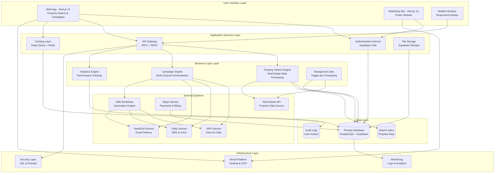

---

## 🧩 Core System Components

### 🖥️ Frontend Applications Layer
**Like the pretty faces users see and interact with**

#### 1. **Main Web Application (`apps/web/`)**
- **Purpose**: User dashboard for property search and campaign management
- **Technology**: Next.js 14 with App Router
- **Key Features**:
  - Property search and filtering
  - Campaign creation and management
  - Integration configuration
  - Analytics dashboard
  - User account management

#### 2. **Marketing Website (`apps/marketing/`)**
- **Purpose**: Public-facing website for lead generation
- **Technology**: Next.js 14 static generation
- **Key Features**:
  - Landing pages
  - Pricing information
  - Feature demonstrations
  - Lead capture forms

#### 3. **Mobile Interface**
- **Purpose**: Responsive design for mobile users
- **Technology**: Progressive Web App (PWA)
- **Key Features**:
  - Touch-optimized interface
  - Offline capabilities
  - Push notifications

### 🛢️ Backend Services Layer
**Like the brain that remembers everything and does the hard work**

#### 1. **Authentication Service**
- **Technology**: Supabase Auth
- **Features**:
  - Email/password authentication
  - OAuth providers (Google, etc.)
  - Session management
  - Role-based access control

#### 2. **API Gateway**
- **Technology**: tRPC + Next.js API Routes
- **Features**:
  - Type-safe API endpoints
  - Request validation
  - Rate limiting
  - Error handling

#### 3. **Caching Layer**
- **Technology**: React Query + Redis
- **Features**:
  - Client-side caching
  - Server-side caching
  - Cache invalidation
  - Performance optimization

### ⚙️ Business Logic Layer
**Like the smart workers that understand your business**

#### 1. **Property Search Engine**
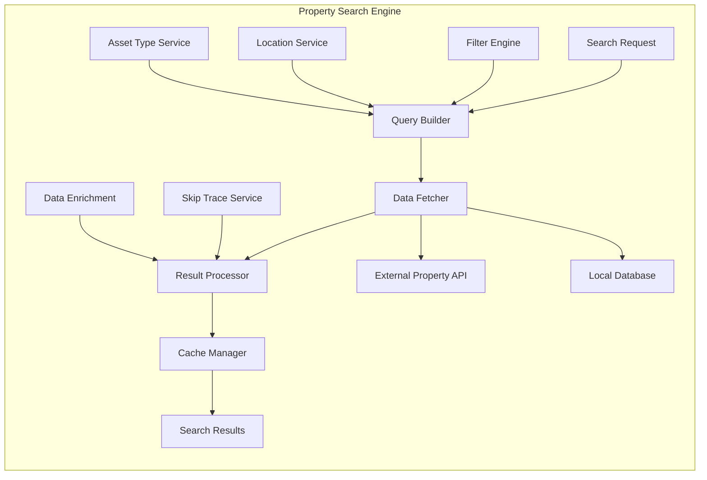

#### 2. **Campaign Engine**
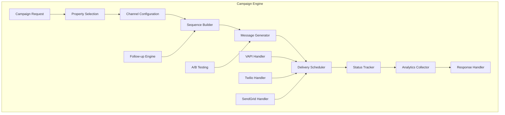

#### 3. **Analytics Engine**
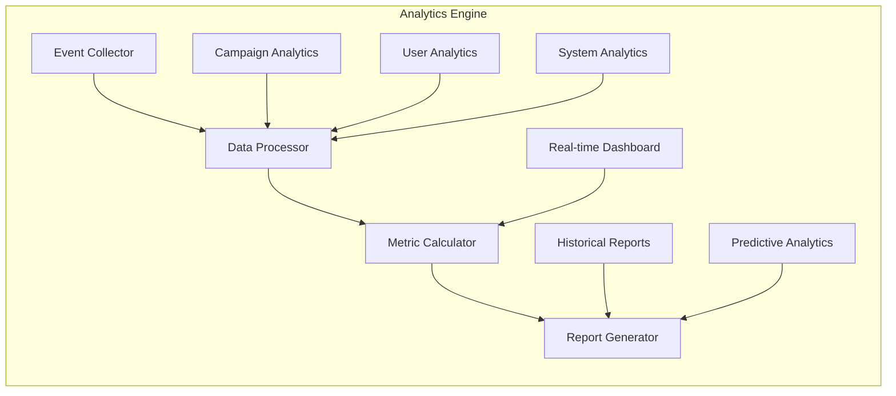

---

## 📊 Database Architecture

### 🗄️ Core Database Design

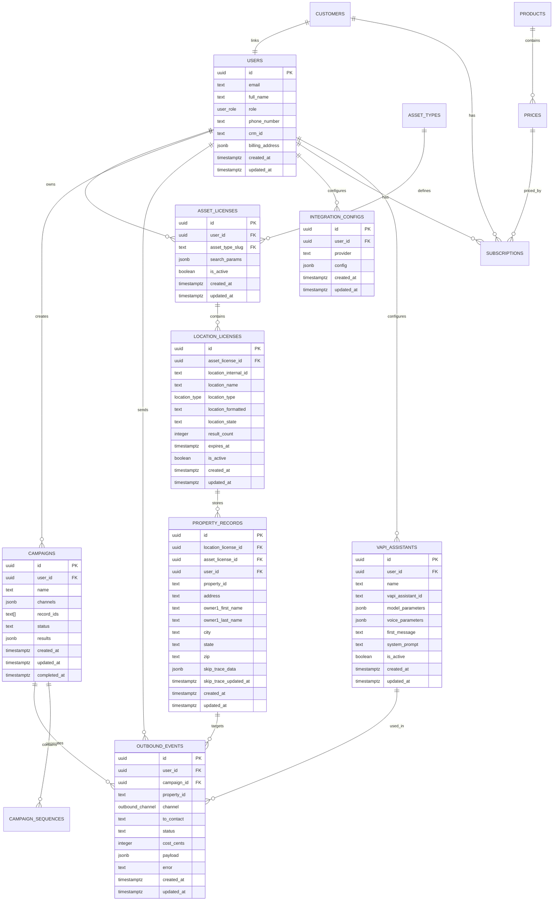

### 📋 Database Table Explanations

#### **👥 Users & Authentication**
- **`users`**: Core user profiles with role-based access
- **`customers`**: Stripe customer mapping for billing
- **`integration_configs`**: Third-party service configurations per user

#### **🏢 Property Management**
- **`asset_types`**: Types of properties (residential, commercial, restaurant)
- **`asset_licenses`**: User subscriptions to property types
- **`location_licenses`**: Specific geographic access permissions
- **`property_records`**: Individual property data with owner information

#### **📢 Campaign System**
- **`campaigns`**: Marketing campaign definitions
- **`outbound_events`**: Individual message sends across all channels
- **`vapi_assistants`**: AI voice assistant configurations

#### **💳 Billing & Subscriptions**
- **`products`**: Stripe product definitions
- **`prices`**: Pricing tiers and subscription options
- **`subscriptions`**: Active user subscriptions

---

## 🔄 System Data Flow

### 🎯 Property Search Flow
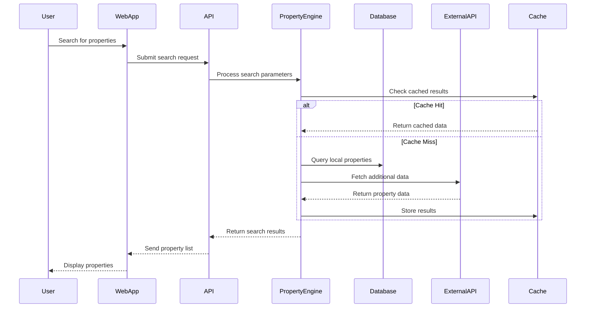

### 📢 Campaign Creation Flow
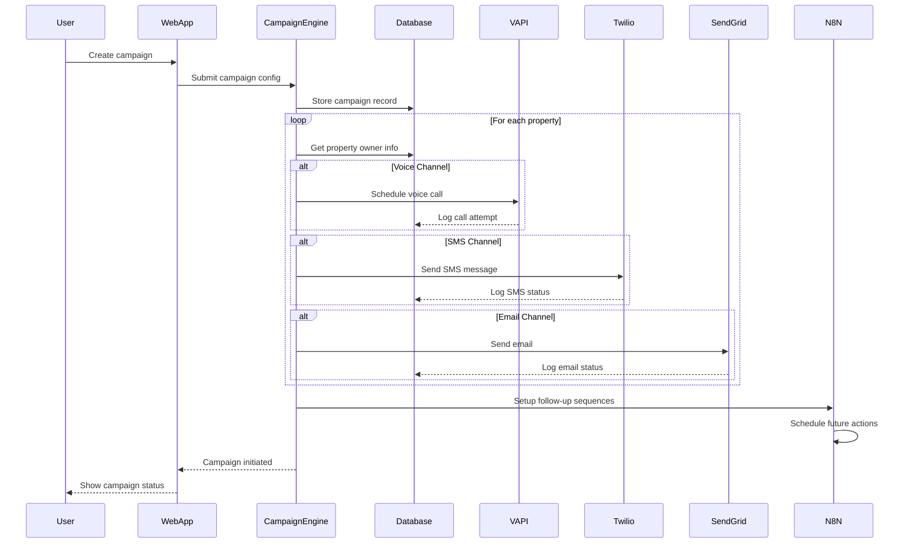

### 💰 Subscription & Billing Flow
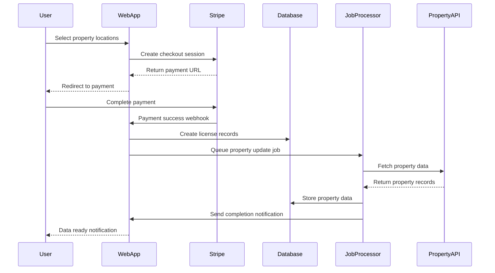

---

## 🔐 Security Architecture

### 🛡️ Authentication & Authorization

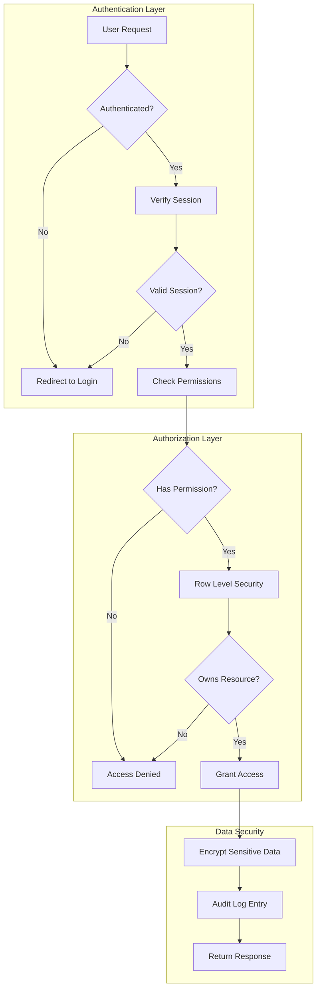

### 🔒 Data Protection Layers

1. **Network Security**
   - HTTPS/TLS encryption for all traffic
   - API rate limiting and DDoS protection
   - Firewall rules and IP filtering

2. **Application Security**
   - Input validation and sanitization
   - SQL injection prevention
   - XSS protection with Content Security Policy

3. **Database Security**
   - Row Level Security (RLS) policies
   - Encrypted data at rest
   - Database connection pooling and timeouts

4. **API Security**
   - JWT token validation
   - API key encryption and rotation
   - Webhook signature verification

---

## 🚀 Performance & Scalability

### ⚡ Performance Optimization Strategy

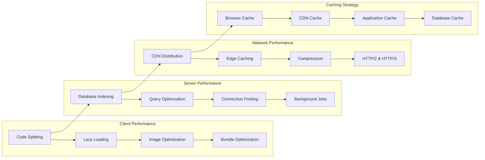

### 📈 Scalability Architecture

1. **Horizontal Scaling**
   - Stateless application design
   - Load balancing across multiple instances
   - Database read replicas
   - Microservices architecture

2. **Vertical Scaling**
   - Resource monitoring and auto-scaling
   - Performance profiling and optimization
   - Memory and CPU optimization

3. **Geographic Scaling**
   - Global CDN distribution
   - Regional data centers
   - Edge computing for reduced latency

---

## 🏗️ Deployment Architecture

### 🌐 Infrastructure Overview

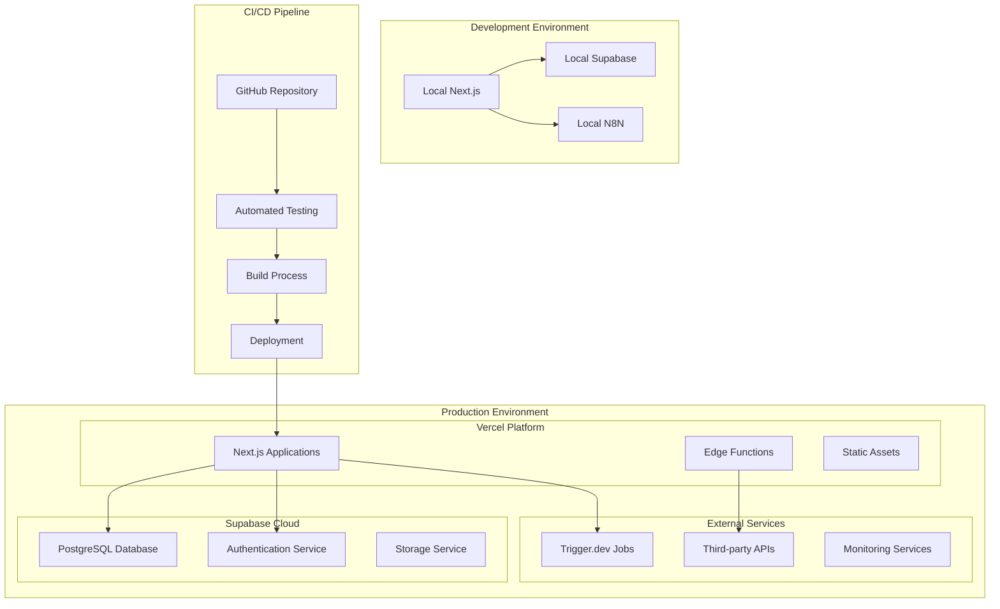

### 🔄 Deployment Strategy

1. **Continuous Integration**
   - Automated testing on every commit
   - Code quality checks and linting
   - Security vulnerability scanning

2. **Continuous Deployment**
   - Automatic deployment to staging
   - Manual approval for production
   - Blue-green deployment strategy

3. **Monitoring & Observability**
   - Real-time error tracking
   - Performance monitoring
   - User analytics and behavior tracking

---

## 📊 System Monitoring

### 📈 Key Metrics Dashboard

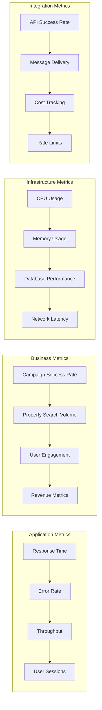

### 🚨 Alerting Strategy

1. **Critical Alerts**
   - System downtime or major errors
   - Database connectivity issues
   - Payment processing failures

2. **Warning Alerts**
   - High response times
   - Increased error rates
   - API rate limit approaching

3. **Information Alerts**
   - Deployment notifications
   - Unusual traffic patterns
   - Scheduled maintenance

---

## 🎯 Summary

The CRE Finder AI system architecture is designed for:

- **🔄 Scalability**: Handle growing user base and data volume
- **🔒 Security**: Protect sensitive property and user data
- **⚡ Performance**: Fast response times and efficient processing
- **🔌 Integration**: Seamless connection with external services
- **📊 Observability**: Complete visibility into system health
- **🚀 Maintainability**: Clean, modular, and well-documented code

This architecture supports the core mission of enabling real estate professionals to find properties and automate their marketing outreach with sophisticated, multi-channel campaigns.
